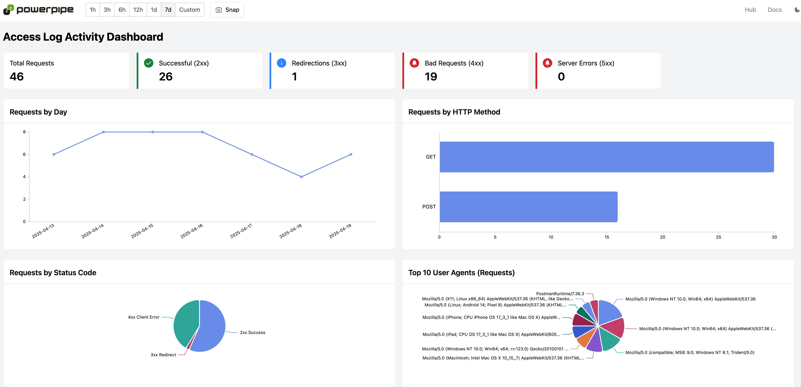

# Nginx Access Log Detections Mod for Powerpipe

[Tailpipe](https://tailpipe.io) is an open-source CLI tool that allows you to collect logs and query them with SQL.

The [Nginx Access Log Detections Mod](https://hub.powerpipe.io/mods/turbot/tailpipe-mod-nginx-access-log-detections) contains pre-built dashboards and detections, which can be used to monitor and analyze activity across your Nginx servers.

Run detection benchmarks:


View insights in dashboards:


## Documentation

- **[Dashboards →](https://hub.powerpipe.io/mods/turbot/tailpipe-mod-nginx-access-log-detections/dashboards)**
- **[Benchmarks and detections →](https://hub.powerpipe.io/mods/turbot/tailpipe-mod-nginx-access-log-detections/benchmarks)**

## Getting Started

### Installation

Install Powerpipe (https://powerpipe.io/downloads), or use Brew:

```sh
brew install turbot/tap/powerpipe
```

Install the mod:

```sh
mkdir dashboards
cd dashboards
powerpipe mod install github.com/turbot/tailpipe-mod-nginx-access-log-detections
```

This mod also requires [Tailpipe](https://tailpipe.io) with the [Nginx plugin](https://hub.tailpipe.io/plugins/turbot/nginx).

Install Tailpipe (https://tailpipe.io/downloads), or use Brew:

```sh
brew install turbot/tap/tailpipe
tailpipe plugin install nginx
```

### Configuration

Configure your log source:

```sh
vi ~/.tailpipe/config/nginx.tpc
```

```hcl
partition "nginx_access_log" "test" {
  source "file"  {
    paths = ["/Users/mscott/nginx_access_logs"]
    file_layout = "%{DATA}.log"
  }
}
```

### Log Collection

Collect logs:

```sh
tailpipe collect nginx_access_log
```

When running `tailpipe collect` for the first time, logs from the last 7 days are collected. Subsequent `tailpipe collect` runs will collect logs from the last collection date.

You can override the default behaviour by specifying `--from`:

```sh
tailpipe collect nginx_access_log --from 2025-01-01
```

You can also use relative times. For instance, to collect logs from the last 60 days:

```sh
tailpipe collect nginx_access_log --from T-60d
```

Please note that if you specify a date in `--from`, Tailpipe will delete any collected data for that partition starting from that date to help avoid gaps in the data.

For additional examples on using `tailpipe collect`, please see [tailpipe collect](https://tailpipe.io/docs/reference/cli/collect) reference documentation.

### Browsing Dashboards

Start the dashboard server:

```sh
powerpipe server
```

Browse and view your dashboards at **http://localhost:9033**.

### Running Benchmarks in Your Terminal

Instead of running benchmarks in a dashboard, you can also run them within your
terminal with the `powerpipe benchmark` command:

List available benchmarks:

```sh
powerpipe benchmark list
```

Run a benchmark:

```sh
powerpipe benchmark run nginx_access_log_detections.benchmark.access_log_detections
```

Different output formats are also available, for more information please see
[Output Formats](https://powerpipe.io/docs/reference/cli/benchmark#output-formats).

## Open Source & Contributing

This repository is published under the [Apache 2.0 license](https://www.apache.org/licenses/LICENSE-2.0). Please see our [code of conduct](https://github.com/turbot/.github/blob/main/CODE_OF_CONDUCT.md). We look forward to collaborating with you!

[Tailpipe](https://tailpipe.io) and [Powerpipe](https://powerpipe.io) are products produced from this open source software, exclusively by [Turbot HQ, Inc](https://turbot.com). They are distributed under our commercial terms. Others are allowed to make their own distribution of the software, but cannot use any of the Turbot trademarks, cloud services, etc. You can learn more in our [Open Source FAQ](https://turbot.com/open-source).

## Get Involved

**[Join #tailpipe and #powerpipe on Slack →](https://turbot.com/community/join)**

Want to help but don't know where to start? Pick up one of the `help wanted` issues:

- [Powerpipe](https://github.com/turbot/powerpipe/labels/help%20wanted)
- [Tailpipe](https://github.com/turbot/tailpipe/labels/help%20wanted)
- [Nginx Access Log Detections Mod](https://github.com/turbot/tailpipe-mod-nginx-access-log-detections/labels/help%20wanted)
